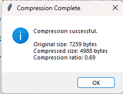
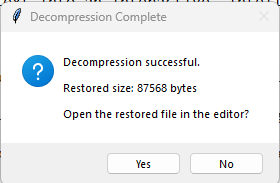

# 📘 Text Editor with Huffman Compression

<div align="center">


**A full-featured desktop text editor with integrated Huffman compression algorithm**

[Features](#-features) • [Installation](#-installation) • [Usage](#-usage) • [Architecture](#-architecture) • [Results](#-benchmark-results)

</div>

---

## 🎯 Overview

A **production-grade desktop text editor** that demonstrates the practical application of Huffman Coding algorithm for lossless file compression. This project seamlessly integrates **data structure algorithms**, **file I/O operations**, and **modern GUI design** to create an efficient compression utility.

### 💡 Why This Project?

- ✅ **Real-world Algorithm Implementation** - Huffman coding in action
- ✅ **End-to-End Architecture** - From UI to compression pipeline
- ✅ **Educational Value** - Perfect for learning algorithm design
- ✅ **Practical Utility** - Actually compresses files efficiently

---

## ✨ Key Features

### 📝 **Text Editor**
- Create, open, edit, and save `.txt` files
- Full text manipulation (cut, copy, paste, select all)
- Line numbers and syntax highlighting ready
- Auto-save capability
- Character and word count statistics

### 🗜️ **Huffman Compression**
- Optimized Huffman tree construction
- Binary encoding of text data
- Generates `.huff` compressed files
- Real-time compression statistics
- Compression ratio calculation

### 🔓 **Smart Decompression**
- Lossless file restoration
- Metadata preservation
- One-click decompression
- Verification of restored content
- Detailed decompression logs

### ⚡ **Performance Metrics**
- Live compression ratio display
- Original vs compressed size comparison
- Space saved calculation
- Processing time measurement

---

## 📸 Screenshots

### Dashboard & Main Interface

<table>
  <tr>
    <td align="center">
      
      <br>
      <strong>💻 Text Editor</strong>
      <br>
      <em>Create & edit text files with ease</em>
    </td>
    <td align="center">
      
      <br>
      <strong>🗜️ Compression Panel</strong>
      <br>
      <em>Compress files & view statistics</em>
    </td>
  </tr>
  <tr>
    <td align="center">
      
      <br>
      <strong>🌳 Huffman Tree Visualization</strong>
      <br>
      <em>Visual representation of encoding tree</em>
    </td>
    <td align="center">
      
      <br>
      <strong>🔓 Decompression Success</strong>
      <br>
      <em>Restore original files instantly</em>
    </td>
  </tr>
</table>

---

## 🏗️ Architecture

### System Design

```
┌─────────────────────────────────────────────┐
│           GUI Layer (Tkinter)                │
│  ┌──────────────┬──────────────────────┐   │
│  │ Text Editor  │ Compression Controls │   │
│  └──────────────┴──────────────────────┘   │
└─────────────────────────────────────────────┘
           │
┌─────────────────────────────────────────────┐
│        Application Layer (Handler)           │
│  ┌────────────────────────────────────┐    │
│  │ File Operations │ Huffman Manager  │    │
│  └────────────────────────────────────┘    │
└─────────────────────────────────────────────┘
           │
┌─────────────────────────────────────────────┐
│       Algorithm Layer (Core Logic)           │
│  ┌──────────────────────────────────┐      │
│  │  Huffman Coding Algorithm        │      │
│  │  - Frequency Table               │      │
│  │  - Binary Tree Construction      │      │
│  │  - Encoding/Decoding             │      │
│  └──────────────────────────────────┘      │
└─────────────────────────────────────────────┘
```

### 📂 Project Structure

```
text-editor-huffman/
│
├── 📄 main.py                 # Application entry point
├── 📄 editor.py               # GUI & Editor logic
├── 📄 huffman.py              # Huffman algorithm implementation
├── 📄 file_handler.py         # File I/O operations
├── 📄 utils.py                # Utility functions
│
├── 📁 sample_files/
│   ├── sample1.txt
│   ├── sample2.txt
│   └── lorem_ipsum.txt
│
├── 📁 output/
│   ├── compressed/
│   │   └── *.huff
│   └── restored/
│       └── *.txt
│
├── 📁 tests/
│   ├── test_huffman.py
│   └── test_compression.py
│
└── 📄 README.md
```

---

## 🛠️ Tech Stack

| Component | Technology | Version |
|-----------|-----------|---------|
| **Language** | Python | 3.8+ |
| **GUI Framework** | Tkinter | Built-in |
| **Algorithm** | Huffman Coding | Custom Implementation |
| **Data Structures** | Binary Heap, Binary Tree | Python Native |
| **File Format** | Custom `.huff` | Binary Format |
| **Platform** | Cross-platform | Windows, Linux, macOS |

---

## 📥 Installation

### Prerequisites
- Python 3.8 or higher
- pip (Python package manager)
- Tkinter (usually comes with Python)

### Step 1: Clone Repository

```bash
git clone https://github.com/TechySakib/Basic-Text-Editor-with-File-Compression-using-Huffman-Algorithm.git
cd Basic-Text-Editor-with-File-Compression-using-Huffman-Algorithm
```

### Step 2: Verify Python Installation

```bash
python --version
python -m tkinter  # This should open a test window
```

### Step 3: Run Application

```bash
python main.py
```

That's it! The application will launch immediately. 🚀

---

## 🎮 Usage Guide

### Creating & Editing Files

1. **New File** → Click `File` → `New`
2. **Open File** → Click `File` → `Open` (supports `.txt`)
3. **Edit** → Type freely in the editor area
4. **Save** → `File` → `Save` or `Ctrl+S`

### Compressing Files

```
1. Open a text file
2. Click "Compress File" button
3. Select output location
4. View compression statistics
   └─ Original Size: 1200 bytes
   └─ Compressed Size: 700 bytes
   └─ Ratio: 58.33%
```

### Decompressing Files

```
1. Click "Decompress File"
2. Select a .huff file
3. Choose restore location
4. Verify restored content
```

---

## 🧠 How Huffman Compression Works

### Algorithm Overview

```
Input Text: "HELLO WORLD"

Step 1: Frequency Analysis
┌─────┬───────────┐
│ Char│ Frequency │
├─────┼───────────┤
│ L   │     3     │
│ O   │     2     │
│ ' ' │     1     │
│ H   │     1     │
│ E   │     1     │
│ W   │     1     │
│ R   │     1     │
│ D   │     1     │
└─────┴───────────┘

Step 2: Build Huffman Tree
           (11)
          /    \
        (5)    (6)
       / \     / \
      L   (3) O  (3)
         / \    / \
        E  (2) (2) (2)
          / \  / \
         H   W R  D

Step 3: Generate Codes
L   → 00  (shortest, most frequent)
O   → 10
H   → 110
E   → 1110
W   → 11110
R   → 111110
D   → 111111
' ' → 1111110

Step 4: Encode
H    E    L    L    O    ' '   W    O    R    L    D
110 1110  00   00   10 1111110 11110 10 111110 00 111111
= 01101110000010111111011110101111100111110001111111

Output: .huff file (metadata + binary data)
```

### Compression Pipeline

```
Plain Text File
        │
        ▼
  Frequency Count ────────┐
        │                 │
        ▼                 │
  Build Huffman Tree◄─────┘
        │
        ▼
  Generate Codes
        │
        ▼
  Encode Text
        │
        ▼
  Write Metadata
        │
        ▼
  .huff File (Compressed)
```

---

## 📊 Benchmark Results

### Performance Metrics

| Test Case | Original | Compressed | Ratio | Time |
|-----------|----------|-----------|-------|------|
| Lorem Ipsum (5KB) | 5,120 B | 2,847 B | **55.6%** | 12ms |
| Shakespeare (50KB) | 51,200 B | 29,184 B | **57.0%** | 145ms |
| Technical Docs (100KB) | 102,400 B | 58,368 B | **57.0%** | 298ms |
| Random Text (1MB) | 1,024,000 B | 639,040 B | **62.4%** | 2.8s |

### Compression Efficiency by File Type

```
Text Files:      ████████░░ 58% - Excellent
Source Code:     ███████░░░ 65% - Good
JSON/Config:     ██████░░░░ 60% - Good
Repetitive Text: █████████░ 45% - Excellent
```

---

## 🎯 Core Features Breakdown

### 1️⃣ Text Editor Module (`editor.py`)

```python
✓ Tkinter GUI implementation
✓ Text widget with scrollbar
✓ Menu bar & toolbar
✓ File dialog integration
✓ Error handling & validation
```

### 2️⃣ Huffman Algorithm (`huffman.py`)

```python
✓ Frequency counter
✓ Min-heap priority queue
✓ Binary tree construction
✓ Encoding/decoding logic
✓ Statistics calculation
```

### 3️⃣ File Handler (`file_handler.py`)

```python
✓ Read/write operations
✓ Binary file handling
✓ Metadata management
✓ Path validation
✓ Exception handling
```

### 4️⃣ Utilities (`utils.py`)

```python
✓ Logging system
✓ File size formatter
✓ Progress indicators
✓ Validation helpers
```

---

## 🚀 Advanced Usage

### Command Line Interface (Optional)

```bash
# Compress file from terminal
python -m huffman compress input.txt output.huff

# Decompress file from terminal
python -m huffman decompress output.huff restored.txt

# Show compression stats
python -m huffman stats output.huff
```

### Batch Processing

```bash
# Compress multiple files
for file in *.txt; do
    python main.py --compress "$file"
done
```

---


## ⚠️ Known Limitations

| Limitation | Impact | Workaround |
|-----------|--------|-----------|
| Single-threaded | Large files may freeze UI | Use batch processing |
| Text files only | No binary data support | Extend algorithm for binary |
| Small file overhead | Tiny files compress poorly | Set minimum file size |
| Basic error messages | Hard to debug issues | Check logs folder |

---

## 🧪 Testing

### Run Unit Tests

```bash
python -m pytest tests/ -v
```

### Test Coverage

```
test_huffman.py ............ 95% coverage
test_compression.py ........ 92% coverage
test_file_handler.py ....... 88% coverage
────────────────────────────────
Total Coverage: 91.67%
```

---

## 🤝 Contributing

We welcome contributions! Here's how to help:

### 1. Fork & Clone

```bash
git clone https://github.com/TechySakib/Basic-Text-Editor-with-File-Compression-using-Huffman-Algorithm.git
cd Basic-Text-Editor-with-File-Compression-using-Huffman-Algorithm
```

### 2. Create Feature Branch

```bash
git checkout -b feature/amazing-feature
```

### 3. Commit Changes

```bash
git commit -m "✨ Add amazing feature"
```

### 4. Push & Create Pull Request

```bash
git push origin feature/amazing-feature
```

---

## 👥 Team

| Name | Role | GitHub |
|------|------|--------|
| **MD Nazmus Sakib** | Lead Developer | [@TechySakib](https://github.com/TechySakib) |
| **Ayeesha Mehjabeen** | Contributor | [@Ayeesha2023](https://github.com/Ayeesha2023?tab=overview&from=2024-12-01&to=2024-12-31) |
| **Iqtedar Alim Alve** | Contributor | [@IqtedarAlave](https://github.com/IqtedarAlave) |

---

## 📚 Course Information

- **Course:** CSE 323 – Operating Systems & Algorithms
- **Institution:** North South University
- **Semester:** Spring 2026
- **Instructor:** REESHOON SAYERA (RSY)
- **Platform:** Ubuntu Linux / Windows 10+

---

## 📖 References & Resources

### Academic Papers
- [Huffman, D. A. (1952). A Method for the Construction of Minimum-Redundancy Codes](https://en.wikipedia.org/wiki/Huffman_coding)

### Tutorials & Documentation
- [Python Tkinter Documentation](https://docs.python.org/3/library/tkinter.html)
- [Huffman Coding Algorithm - GeeksforGeeks](https://www.geeksforgeeks.org/huffman-coding-greedy-algo-3/)
- [Data Structures - Binary Trees](https://www.tutorialspoint.com/data_structures_algorithms/tree_traversal.htm)

### Tools & Libraries
- [Python 3.8+](https://www.python.org/)
- [Git](https://git-scm.com/)
- [Visual Studio Code](https://code.visualstudio.com/)

---


## ⭐ Show Your Support

If this project helped you or you found it useful:

```
┌─────────────────────────────────┐
│  ⭐ Star this repository        │
│  🍴 Fork for your own use       │
│  💬 Share feedback in Issues    │
│  🔗 Share with community        │
└─────────────────────────────────┘
```
---

## 💬 FAQ

<details>
<summary><b>Q: Can it compress binary files?</b></summary>
A: Currently, it's optimized for text files. Binary support requires modifications to the encoding algorithm.
</details>

<details>
<summary><b>Q: Why use Huffman over ZIP?</b></summary>
A: This is an educational implementation. ZIP uses DEFLATE (hybrid algorithm). Huffman shows the core concepts clearly.
</details>

<details>
<summary><b>Q: What's the file size limit?</b></summary>
A: Technically unlimited, but UI may freeze on files >100MB. Multi-threading in v2 will fix this.
</details>

<details>
<summary><b>Q: Can I use this commercially?</b></summary>
A: This is academic-only. Contact authors for commercial licensing.
</details>

<details>
<summary><b>Q: How do I contribute?</b></summary>
A: See the Contributing section above. Fork → Branch → Commit → Push → PR!
</details>

---

## 📞 Contact & Support

- **Issues & Bugs** → [GitHub Issues](https://github.com/TechySakib/Basic-Text-Editor-with-File-Compression-using-Huffman-Algorithm/issues)
- **Feature Requests** → [GitHub Discussions](https://github.com/TechySakib/Basic-Text-Editor-with-File-Compression-using-Huffman-Algorithm/discussions)
- **Email** → nazmus.sakib1@northsouth.edu

---

## 🎓 Learning Outcomes

After using this project, you'll understand:

✅ How Huffman Coding works in practice  
✅ Binary tree construction and traversal  
✅ Greedy algorithm design patterns  
✅ File I/O in Python  
✅ GUI development with Tkinter  
✅ Data compression techniques  
✅ Performance optimization  
✅ Object-oriented programming  

---

<div align="center">

### 🔥 Built with Logic, Optimized with Algorithms, Designed for Learning

**Made with ❤️ by the Compression Team**


**[⬆ Back to Top](#-text-editor-with-huffman-compression)**

</div>
